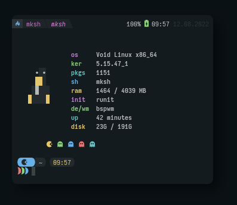

<div align="center">
<h1>rxfetch<h1>
 


<br>

</div>

This is a fork of [rxfetch by Mangeshrex](https://github.com/Mangeshrex/rxfetch)
with inspiration from [nwvh's version](https://github.com/nwvh/rxfetch-stylish)

## About

Custom system fetching tool written in bash script.

## Requirements

- Material design icons as for that pacman and ghost icons.
- You need to put the provided fonts in the fonts directory to get the icons work.
- If wanted you can change the source code of the fetch as per your needs.
- If you already use material-design-icons you can just use the command below to install it.


## Run with curl

If you don't wanna clone this repo or install rxfetch, you can use curl.

```yaml
$ curl https://raw.githubusercontent.com/NotNoss/rxfetch/main/rxfetch | bash
```

## Install
```bash
# run the install script
# NOTE: IT IS A BAD IDEA TO BLINDLY RUN SCRIPTS FROM THE INTERNET AS ROOT. I RECOMMEND YOU USE METHOD TWO TO DOWNLOAD AND READ THE SCRIPT PRIOR TO RUNNING. RUN AT YOUR OWN RISK
$ wget -O - https://raw.githubusercontent.com/NotNoss/rxfetch/main/install.sh | sudo bash
$ rxfetch

# or

# Download install script
$ wget -O ./install.sh https://raw.githubusercontent.com/NotNoss/rxfetch/main/install.sh
# View the file to ensure contents are safe
$ nano ./install.sh
# Make the file executable
$ chmod +x ./install.sh
# Run script
$ sudo ./install.sh
$ rxfetch
```

## Uninstall
```bash
# run the uninstall script
# NOTE: IT IS A BAD IDEA TO BLINDLY RUN SCRIPTS FROM THE INTERNET AS ROOT. I RECOMMEND YOU USE METHOD TWO TO DOWNLOAD AND READ THE SCRIPT PRIOR TO RUNNING. RUN AT YOUR OWN RISK
$ wget -O - https://raw.githubusercontent.com/NotNoss/rxfetch/main/uninstall.sh | sudo bash
$ rxfetch

# or

# Download install script
$ wget -O ./install.sh https://raw.githubusercontent.com/NotNoss/rxfetch/main/uninstall.sh
# View the file to ensure contents are safe
$ nano ./uninstall.sh
# Make the file executable
$ chmod +x ./uninstall.sh
# Run script
$ sudo ./uninstall.sh
$ rxfetch
```
